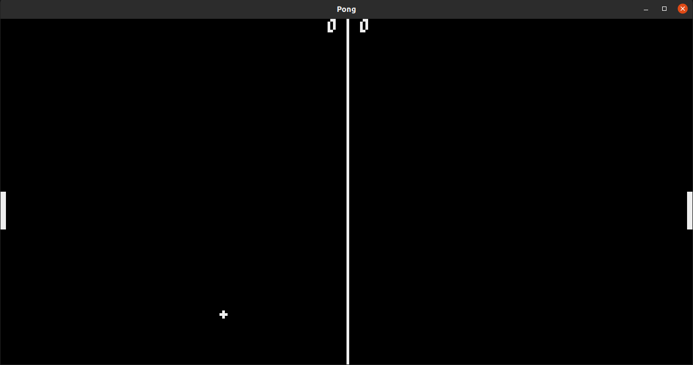

# Pong [WIP]

[Pyxel](https://github.com/kitao/pyxel) implementation of the classic game of Pong!

- Left paddle is controlled with __W__ and __S__
- Right paddle is controlled with __↑__ and __↓__
- No win condition atm
- Simple physics
- No sound
- No power-ups
